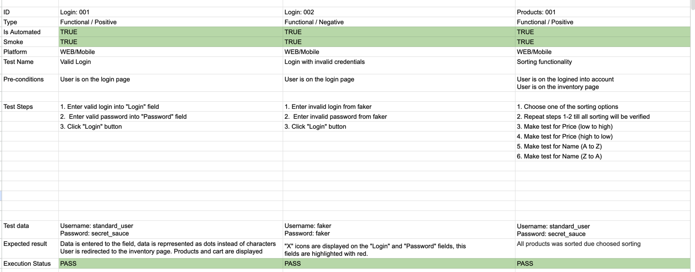
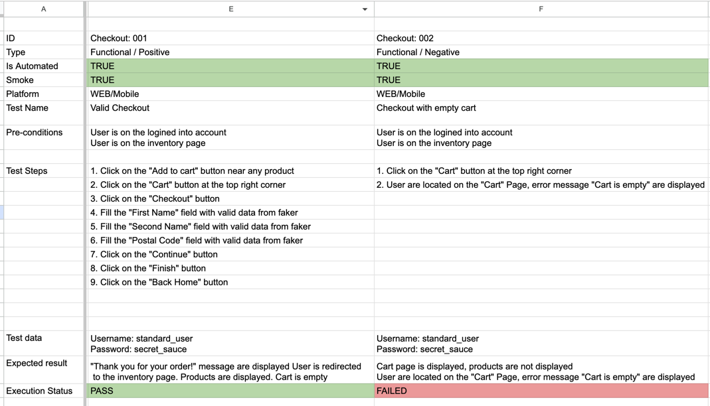

# Playwright UI framework for Smoke Swag-Labs

## Requirements
- Node v25
- Playwright v1.58

## Automated test cases



## Project structure
### Folder structure
1. `src` - folder that contains the project.
2. `tests` - folder that contains fixtures and tests. Root file `base.fixture.ts` contains base fixtures and expects to be used across the tests. Each subfolder represent the part of the application this subfloder is testing.
3. `pages` - all interactions with the application and are encapsulated in the Page Objects under this folder
4. `utils` -  folder that contains all the utils, types and links.

## Installation
Make sure you have the correct node version.
```sh
node -v
```
## Building Service
### Prepare service
1. Go to root project folder
2. Install Playwright:
```sh
npm init playwright@latest
```
Install Playwright deps:
```sh
npx playwright install --with-deps
```
## Project configuration
1. Playwright Configuration: See `playwright.config.ts` for global settings such as test directory, timeout.

## Test execution
1. To execute tests, run `npx playwright test`
2. If you need to debug your tests, use [link](https://playwright.dev/docs/test-cli)

If you want to see the test report:
```
$ npx playwright show-report
```